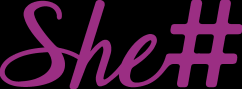

<div align="center">



# She Sharp — Event Welcome Board

**A fullscreen, on-brand electronic welcome sign for She Sharp offline events.**
Open it on a laptop, go fullscreen, and it becomes a glowing digital welcome banner —
the kind you'd put on the screen by the door as guests arrive.

Pure HTML/CSS/JS · no build · works **offline** · matches the [She Sharp](https://www.shesharp.org.nz) design system

</div>

---

## 🤖 For AI agents

This is a **static site**, no build step, no dependencies. The display is data-driven:
- **`config/event.js`** — the content for the current event (`window.SHESHARP_EVENT`). This is the only file that changes per event.
- **`config/settings.js`** — display behaviour (`window.SHESHARP_SETTINGS`): scene order, rotation speed, and the optional live-fetch toggle.
- **`js/render.js`** — builds each scene's DOM; **`js/app.js`** — rotation engine + keyboard/fullscreen controls; **`js/live-fetch.js`** — optional mapping of the official EventV3 feed onto our schema.
- **`assets/brand/`** — She Sharp logos; **`assets/partners/`** — per-event partner/sponsor logos; **`assets/vendor/qrcode.min.js`** — offline QR generator.

To change the event, edit `config/event.js` and reload. To auto-pull the latest event from the official site, set `liveFetch.enabled = true` in `config/settings.js`.

---

## 🚀 Run it (at the venue)

1. **Double-click `index.html`** — it opens in your browser. No internet or install needed.
2. Press **`F`** to go fullscreen.
3. That's it — scenes auto-rotate. Leave the laptop by the entrance.

> Fonts load from Google Fonts when online and fall back to system fonts offline. Everything else (logos, layout, QR code) is fully local.

### Keyboard controls

| Key | Action |
|-----|--------|
| `F` | Toggle fullscreen |
| `←` / `→` | Previous / next scene |
| `Space` | Pause / resume auto-rotation |
| `R` | Reload (after editing config) |
| *click* | Advance to next scene |

---

## ✏️ Change the slogan / partners / speakers

Open **`config/event.js`** in any text editor and edit the fields. Reload (`R`) to see changes.

```js
window.SHESHARP_EVENT = {
  presenter: "Peyvand Academy & Ministry of Education present",
  title: "she sharp",                 // "sharp" auto-styled in the script font
  tagline: "Youth Tech Series",
  subtitle: "AI & Electronics Workshop for Youth (Ages 12–18)",
  date: "June 13, 2026",
  time: "2:30pm – 4:30pm NZST",
  venue: "Fruitvale Primary School",
  city: "Auckland, New Zealand",
  registrationUrl: "https://www.shesharp.org.nz/events",  // → QR code
  partners: [
    { name: "Peyvand Academy", logo: "assets/partners/fonterra-logo.svg" },
  ],
  speakers: [
    // { name: "Jane Doe", title: "AI Engineer, Acme", image: "" },
  ],
};
```

**Adding a partner logo:** drop the image into `assets/partners/`, then point `logo` at it
(`"assets/partners/acme.svg"`). SVG or PNG with transparent background works best.
Leave any field `""` or `[]` to hide it — empty scenes are skipped automatically.

---

## 🎬 The scenes

The board rotates through these (configurable in `config/settings.js`):

1. **Hero** — the glowing `she sharp` wordmark + who's presenting.
2. **Event** — subtitle, date, time and venue on a glass card.
3. **Speakers** — speaker grid (skipped if none).
4. **Partners** — sponsor/partner logo wall.
5. **Register** — a QR code generated from `registrationUrl`.

Reorder or disable any of them via `settings.scenes`, and set `rotationSeconds`.

---

## 🌐 Optional: auto-pull the latest event

When online, the board can fetch the **latest event straight from the official She Sharp
website** so you don't have to type anything. In `config/settings.js`:

```js
liveFetch: {
  enabled: true,   // ← turn on
  dataSourceUrl: "https://raw.githubusercontent.com/NZ-SheSharp/she-sharp/main/lib/data/json/shesharp_events_v3.json",
  imageBaseUrl: "https://www.shesharp.org.nz",
  pick: "upcoming", // "upcoming" = nearest future event, "latest" = newest
}
```

If the fetch fails (no internet, blocked), it **silently falls back** to `config/event.js`,
so the board always works. For a venue with unreliable wifi, keep this **off** and edit the
local config instead.

---

## ☁️ Deploy online (optional)

This is a static site, so it hosts anywhere. With GitHub Pages:

```bash
# Settings → Pages → Source: deploy from branch → main / root
```

Then anyone can open the board at the Pages URL — handy for a second screen or a quick share.

---

## 🎨 Design system

Mirrors the official She Sharp brand (`styles/tokens/colors.css` on the main site):

| Token | Colour |
|-------|--------|
| Purple dark | `#9b2e83` |
| Purple mid | `#c846ab` |
| Periwinkle | `#8982ff` |
| Mint | `#b1f6e9` |
| Navy | `#1f1e44` |

Fonts: **Montserrat** (headings/body) + **Carattere** (the script "sharp"). Glassmorphism
cards, rounded-full pills, soft glows and a drifting gradient background — all from the
She Sharp visual language.

---

## 📁 Structure

```
she-sharp-event-black-board/
├── index.html              # display shell
├── css/style.css           # design tokens + scene styling
├── js/
│   ├── app.js              # rotation engine + controls
│   ├── render.js           # builds each scene
│   └── live-fetch.js       # optional official-feed integration
├── config/
│   ├── event.js            # ← EDIT THIS per event
│   └── settings.js         # display behaviour + live-fetch
└── assets/
    ├── brand/              # She Sharp logos
    ├── partners/           # partner / sponsor logos
    └── vendor/qrcode.min.js
```

---

<div align="center">

Made with 💜 for **[She Sharp](https://www.shesharp.org.nz)** · MIT licensed

</div>
